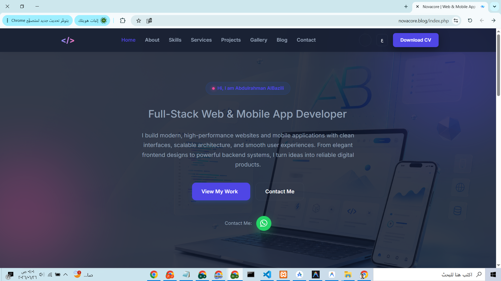
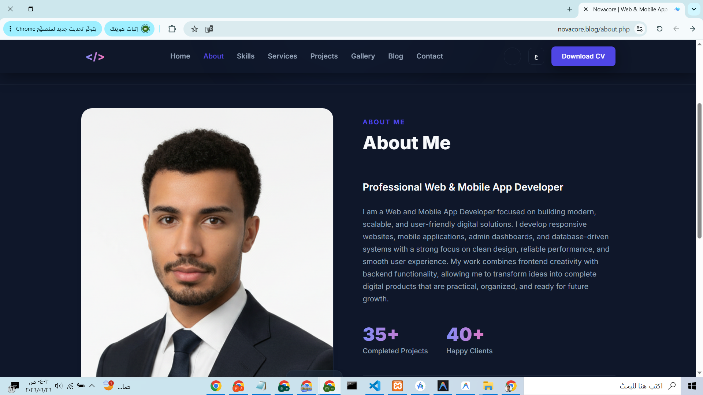
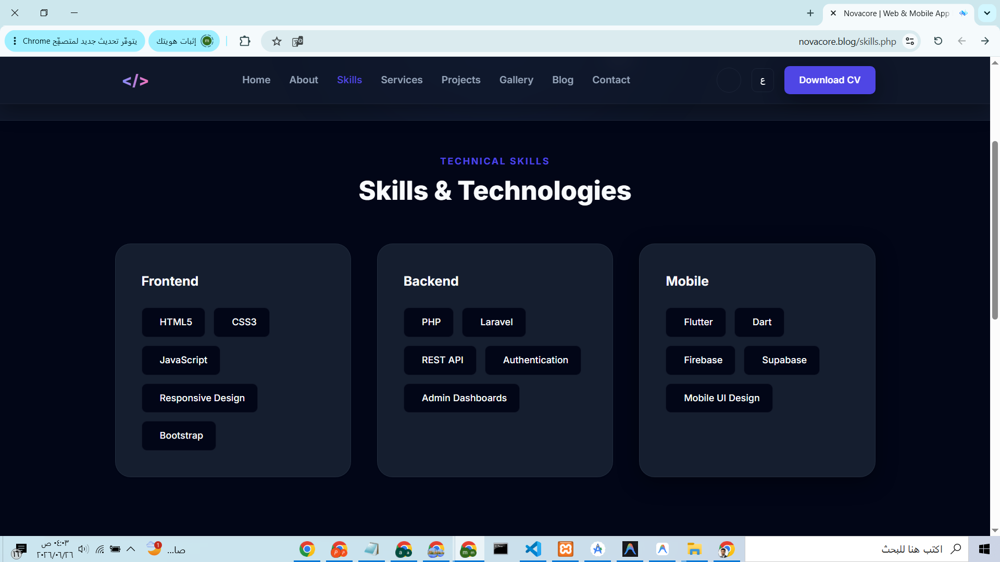
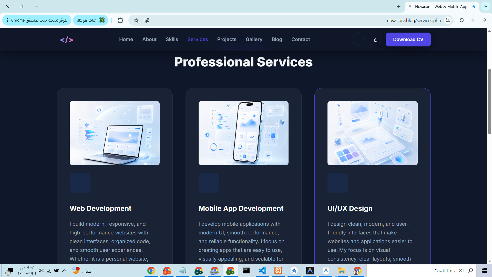
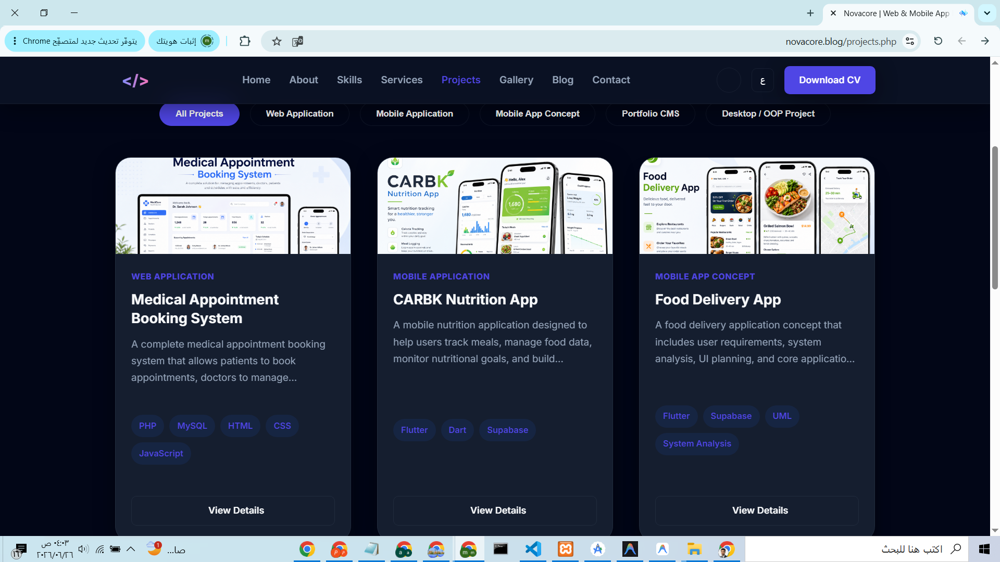
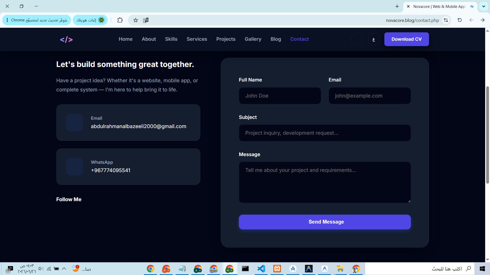

# Personal Portfolio Website

A modern and responsive personal portfolio website built with HTML, CSS, JavaScript, and PHP.

The project is designed to showcase personal information, skills, services, projects, blog content, and contact details in a clean and professional layout. It includes a modern dark interface, smooth sections, organized pages, and a user-friendly experience for visitors and potential clients.

---

## 🌐 Live Preview

You can view the live website here:

[Visit Website](https://novacore.blog/index.php)

---

## 🚀 Features

* Responsive personal portfolio layout
* Modern homepage with professional introduction
* About section
* Skills section
* Services section
* Projects showcase
* Project details page
* Gallery section
* Blog page
* Blog details page
* Contact page
* Clean and organized code structure
* Simple and user-friendly interface
* Professional dark UI design

---

## 🛠️ Technologies Used

* HTML5
* CSS3
* JavaScript
* PHP
* Git
* GitHub

---

## 📁 Project Structure

```text
personal-portfolio/
│
├── index.php
├── contact.php
├── projects.php
├── project-details.php
├── blog.php
├── blog-details.php
├── alter_services.php
│
├── style.css
├── script.js
│
├── screenshots/
│   ├── home.png
│   ├── About.png
│   ├── Skills.png
│   ├── Services.png
│   ├── Projects.png
│   └── Contact.png
│
├── README.md
└── LICENSE
```

---

## 📌 Pages

### Home

The main landing page that introduces the portfolio and highlights the developer profile, main services, and call-to-action buttons.

### About

A section that presents personal information, background, experience, and a short professional introduction.

### Skills

A section that displays technical skills and tools used in web and mobile app development.

### Services

A page or section that presents the services offered, such as web development, mobile app development, UI improvements, and digital solutions.

### Projects

A page that displays portfolio projects and previous work.

### Project Details

A dedicated page for showing detailed information about a specific project.

### Gallery

A section for displaying visual content, project images, or portfolio-related media.

### Blog

A page for displaying blog posts, articles, or development-related content.

### Blog Details

A dedicated page for showing full details of a specific blog post.

### Contact

A contact page that allows visitors to find contact information or communicate with the developer.

---

## 📸 Screenshots

### Home Page



### About Page



### Skills Page



### Services Page



### Projects Page



### Contact Page



---

## ⚙️ How to Run

1. Download or clone the repository:

```bash
git clone https://github.com/abufahd-byte/personal-portfolio.git
```

2. Move the project folder to:

```text
xampp/htdocs/
```

3. Start Apache from XAMPP.

4. Open the project in your browser:

```text
http://localhost/personal-portfolio
```

---

## 👨‍💻 Author

**Abdulrahman AlBazeili**
GitHub: [@abufahd-byte](https://github.com/abufahd-byte)

---

## 📄 License

This project is licensed under the MIT License.
